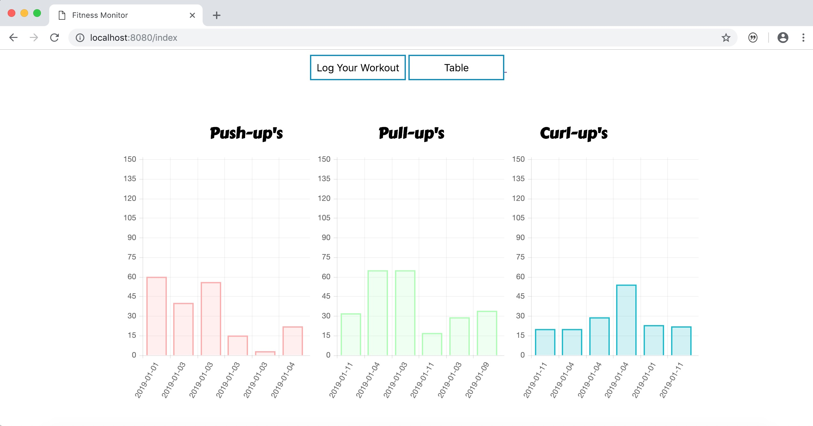

# fitness-monitor
A minimalist monitor to manage infinite New Year fitness resolutions.

## 🛠 Installation

Download Dependencies
 - python3 (``brew install python3``)
   - flask (``pip3 install flask``)

Download Source Code
 - ``git clone https://www.github.com/AaditT/fitness-monitor``)

 ## 🔑 Usage
 - Running the web server: ``python3 main.py``
 - Launch the app in your browser: ``http://localhost:5000/``

##### Here's to the fulfillment of fitness resolutions 🥂
